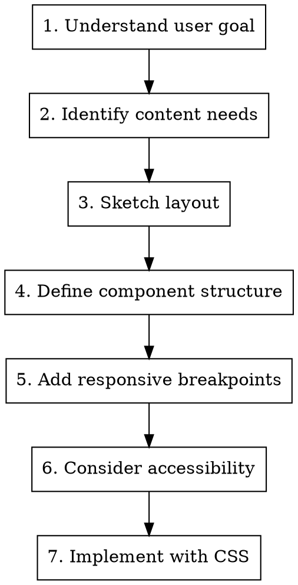

# Frontend Design

Create user-centered frontend designs with focus on accessibility, responsiveness, and modern UX patterns.

**Core principle:** Design for all users, all devices, all contexts. User needs first, then technical implementation.

## When to Use

- Creating new UI components or pages
- Designing responsive layouts
- Planning information architecture
- Designing component systems
- Planning UX flows and interactions

## Design Principles

### Accessibility First
- Semantic HTML structure
- ARIA labels where needed
- Keyboard navigation support
- Color contrast (WCAG AA minimum)
- Focus indicators

### Mobile-First Responsive
- Start with mobile layout
- Progressive enhancement for larger screens
- Touch-friendly touch targets (min 44x44px)
- Avoid horizontal scrolling
- Optimize for readability

### Visual Hierarchy
- Clear content structure with headings
- Consistent spacing system
- Limited color palette (3-5 colors max)
- Typography scale (4-6 sizes)
- Purposeful use of visual weight

## Component Design Process



## Layout Patterns

### Common Layouts

| Pattern | Use Case | Key Considerations |
|---------|----------|-------------------|
| **Single Column** | Mobile-first, simple content | Keep max-width for readability |
| **Two Column** | Content + sidebar | Use grid or flexbox |
| **Card Grid** | Product lists, galleries | Responsive columns (1→2→3→4) |
| **Hero Section** | Landing pages | Clear CTA, compelling visual |
| **Dashboard** | Admin panels | Information density balance |
| **Split Screen** | Feature highlights | Equal or proportional split |

### Spacing System

Use consistent spacing scale (8px base):
- `4px` — tight spacing (icon + label)
- `8px` — default spacing (related elements)
- `16px` — section spacing (groups)
- `24px` — component spacing
- `32px` — page sections

## Typography

### Hierarchy

| Level | Size | Weight | Use Case |
|-------|------|--------|----------|
| H1 | 32-48px | Bold | Page title |
| H2 | 24-32px | Semibold | Section headers |
| H3 | 18-24px | Medium | Subsections |
| Body | 16-18px | Regular | Main content |
| Small | 14px | Regular | Captions, metadata |

### Best Practices

- Line height: 1.5-1.6 for body text
- Max line length: 60-75 characters for readability
- Font fallback stack always included
- Avoid too many typefaces (1-2 max)

## Color System

### Palette Structure

```
Primary (brand color)
├── 50 — very light (backgrounds)
├── 100-200 — light (hover states)
├── 400-500 — base color
├── 600-700 — dark (active states)
└── 900 — very dark (text)

Neutral (grays)
├── text-primary (900)
├── text-secondary (600)
├── borders (300)
├── backgrounds (50-100)

Semantic
├── success (green)
├── error (red)
├── warning (yellow)
└── info (blue)
```

### Contrast Requirements

- WCAG AA: 4.5:1 for normal text, 3:1 for large text
- WCAG AAA: 7:1 for normal text, 4.5:1 for large text
- Always test with real user scenarios

## Component Design Guidelines

### Buttons

| Type | Usage | States |
|------|-------|--------|
| Primary | Main action | default, hover, active, disabled |
| Secondary | Alternative action | default, hover, active, disabled |
| Ghost | Low emphasis | default, hover, active, disabled |
| Danger | Destructive | default, hover, active, disabled |

**Touch target:** Minimum 44x44px
**Focus:** Visible outline with offset
**Loading:** Show spinner or disabled state

### Form Elements

- Labels above or to the left (never inside)
- Error messages inline with field
- Validation on blur or submit
- Character count for textareas
- Group related fields in fieldsets

### Cards

- Consistent padding (16-24px)
- Subtle shadow on hover
- Border radius (4-8px)
- Clear visual hierarchy
- Action buttons at bottom

### Modals

- Overlay with backdrop blur
- Close button top-right
- Focus trap
- ESC key to close
- Mobile: bottom sheet

## Responsive Breakpoints

| Device | Width | Columns |
|--------|-------|---------|
| Mobile | < 640px | 1 |
| Tablet | 640-1024px | 2-3 |
| Desktop | 1024-1440px | 3-4 |
| Large | > 1440px | 4+ |

**Approach:** Mobile-first, use `min-width` media queries
```css
/* Base (mobile) */
.container { width: 100%; }

/* Tablet */
@media (min-width: 640px) {
  .container { width: 50%; }
}

/* Desktop */
@media (min-width: 1024px) {
  .container { width: 33.33%; }
}
```

## Accessibility Checklist

- [ ] Semantic HTML (header, main, nav, section, etc.)
- [ ] Alt text for images (empty alt for decorative)
- [ ] ARIA labels on interactive elements
- [ ] Keyboard navigation works (tab, arrows, space, enter)
- [ ] Focus indicators visible on all interactive elements
- [ ] Color contrast meets WCAG AA
- [ ] Form error messages associated with inputs
- [ ] Skip to main content link
- [ ] Heading hierarchy logical (no skipped levels)
- [ ] Text resize works up to 200%

## CSS Architecture

### BEM Convention

```css
.card { /* Block */ }
.card__title { /* Element */ }
.card__image { /* Element */ }
.card--featured { /* Modifier */ }
.card--large { /* Modifier */ }
```

### Utility-First

```css
.mt-4 { margin-top: 16px; }
.p-2 { padding: 8px; }
.text-center { text-align: center; }
.flex { display: flex; }
```

### Modern CSS Features

- CSS Custom Properties (variables)
- Flexbox for 1D layouts
- Grid for 2D layouts
- Container queries (when supported)
- `clamp()` for responsive typography
- Aspect ratio boxes

## Common Mistakes

| Mistake | Fix |
|---------|-----|
| Fixed widths on main content | Use max-width and fluid widths |
| Touch targets too small | Minimum 44x44px |
| Poor contrast | Test with contrast checker |
- Missing focus styles | Add visible focus outline |
| Color-only indicators | Add icon + color |
| Infinite scroll without pagination | Provide alternatives |
| Auto-play media | Add user control |
| Tiny fonts | Minimum 16px for body |

## Testing

### Cross-Browser
- Chrome, Firefox, Safari, Edge
- iOS Safari, Android Chrome

### Screen Readers
- NVDA (Windows)
- VoiceOver (macOS/iOS)
- TalkBack (Android)

### Devices
- Mobile (320px-428px)
- Tablet (768px-1024px)
- Desktop (1440px+)

## Quick Reference

| Need | Solution |
|------|----------|
| Responsive grid | CSS Grid with `minmax()` |
| Center content | Flexbox `justify-content: center` |
| Sticky footer | `min-height: 100vh; grid-template-rows: auto 1fr auto` |
| Equal height cards | `align-items: stretch` |
| Mobile menu | CSS hamburger + drawer |
| Dark mode | CSS custom properties with `@media (prefers-color-scheme)` |
